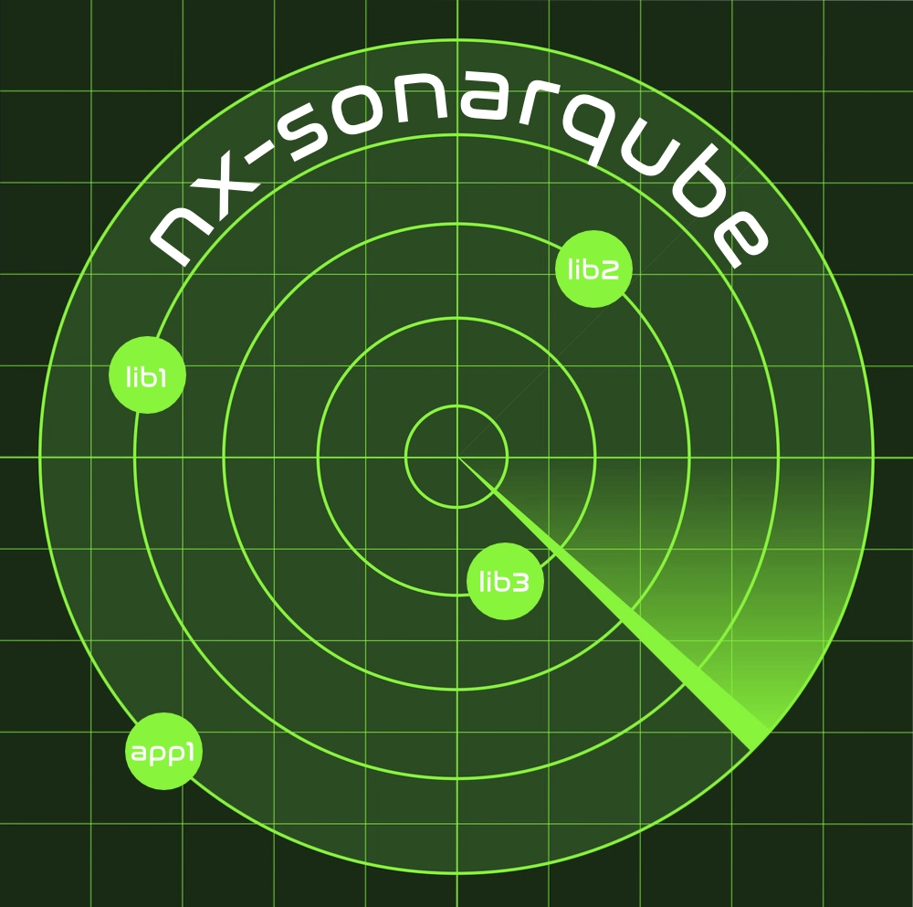

# @koliveira15/nx-sonarqube

A Nx Plugin that contains executors and generators to support scanning projects using Sonar

## Get Started

Go to the [documentation site](https://nx-sonarqube.dev/) to get started
