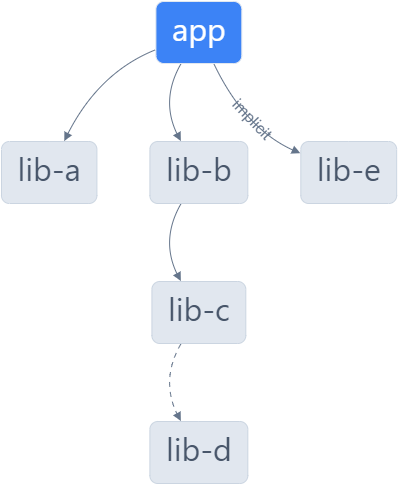

import { Code } from '@astrojs/starlight/components';
import { Tabs, TabItem } from '@astrojs/starlight/components';
import jestConfig from '../../../data/examples/jest.config?raw';
import viteConfig from '../../../data/examples/vite.config.tmpl?raw';
import projectJson from '../../../data/examples/executor.json?raw';

Sonar is a powerful tool for code quality analysis, offering insights into code health, bugs, vulnerabilities, and more.
This document explains how scanning works with nx-sonarqube and Sonar.

## Dependency Graph

Working in a monorepo typically involves an application project and imported library projects. One of Nx's most
important features is to calculate how projects depend on each other called the [dependency graph](https://nx.dev/nx-api/nx/documents/dep-graph#graph).
The dependency graph is core to how the nx-sonarqube Nx Plugin can determine which projects to include in a given scan.

There are three kinds of dependencies the graph can calculate:
  * [Static](https://nx.dev/extending-nx/recipes/project-graph-plugins#static-dependencies) - a hardcoded import
  * [Dynamic](https://nx.dev/extending-nx/recipes/project-graph-plugins#dynamic-dependencies) - a runtime import (e.g. lazy-loaded routes)
  * [Implicit](https://nx.dev/extending-nx/recipes/project-graph-plugins#implicit-dependencies) - not associated with any file or code

Here is an example of the dependency graph for a project `app` to be scanned:

The project `app` has the following dependencies that will be included in the scan:
  * 4 static (`app`, `lib-a`, `lib-b`, `lib-c`)
  * 1 dynamic (`lib-d`)
  * 1 implicit (`lib-e`)

## What is Included?

Based on the dependency graph above, the following is added to the Sonar analysis:

### Source Code

The source code is the code which, presumably, is included in your production build output. This is the code that
developers would like scanned to find bugs, code smells, etc.

The source code paths are included in the scanner by using the respective `project.json`'s
[sourceRoot](https://nx.dev/nx-api/devkit/documents/ProjectConfiguration#sourceroot) property:

<Code code={projectJson} lang="json" title="apps/app/project.json" mark={['"apps/app/src"']}/>

:::caution
The scanner will default to using project root (e.g., `apps/app`) if `sourceRoot` is not present since it can be an
optional project configuration property
:::

### Unit Test Coverage

Unit test coverage refers to a metric used in software development to measure the extent to which the source code of a
program is executed when its unit tests run. It quantifies the amount of source code that is tested by unit tests.

The unit test coverage report (lcov) is determined based on the supported [Jest](https://nx.dev/nx-api/jest/executors/jest#nxjestjest)
or [Vitest](https://nx.dev/nx-api/vite/executors/test) configurations:

<Tabs>
  <TabItem label="Jest">
    <Code code={jestConfig} lang="typescript" title="libs/lib-a/jest.config.ts" mark={["'../../coverage/libs/lib-a'"]}/>
  </TabItem>
  <TabItem label="Vitest">
    <Code code={viteConfig} lang="typescript" title="libs/lib-e/vitest.config.ts" mark={["'../../coverage/libs/lib-e'"]}/>
  </TabItem>
</Tabs>
