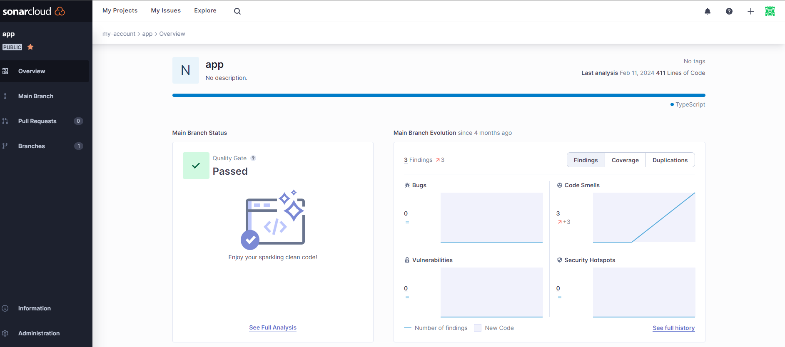

import { Code } from '@astrojs/starlight/components';
import sonarTargetJson from '../../../data/examples/executor.json?raw';
import nxJson from '../../../data/examples/nx.json?raw';
import terminalOutput from '../../../data/examples/terminal-output.txt?raw';

This tutorial will demonstrate how to scan a project using the nx-sonarqube Nx Plugin and upload the results to Sonar

## Prerequisites

1. [Nx workspace](https://nx.dev/getting-started/intro)
2. [nx-sonarqube](/getting-started#installation)
3. [@nx/jest](https://nx.dev/nx-api/jest/executors/jest) or [@nx/vite](https://nx.dev/nx-api/vite/executors/test) test executors with code coverage enabled
4. [Sonar](https://docs.sonarsource.com/sonarqube/latest/try-out-sonarqube/)

## Steps

1. Given the existing project to be scanned is named `app`, run the following generator:

   ```sh
   npx nx g @koliveira15/nx-sonarqube:config app
   ```

2. The generator will create the following changes:

   - The `sonar` target is added:

     <Code code={sonarTargetJson} lang="json" title="apps/app/project.json" mark='"sonar"'/>

   - The `sonar` and `test` targets are added so that `test` will depend on the project dependencies' tests:

     <Code code={nxJson} lang="json" title="nx.json" mark={['"sonar":', '"test":']}/>

3. Sonar can require authentication credentials. You can set these via environment variables using the [Define Environment Variables Recipe](https://nx.dev/recipes/tips-n-tricks/define-environment-variables)

   - **SONAR_LOGIN**: The authentication token or login of a SonarQube user with either Execute Analysis permission on the project or Global Execute Analysis permission
   - **SONAR_PASSWORD**: If you're using an authentication token, leave this blank. If you're using a login, this is the password that goes with your SONAR_LOGIN username

4. Execute the `sonar` task against the `app` project:

   ```sh
   npx nx sonar app
   ```

5. The executor will output the following to the terminal where the status of scan can be checked:

   <Code code={terminalOutput} title="output" mark={['PASSED', 'https://sonarcloud.io/dashboard?id=app']}/>

6. Click the link in the terminal out & log into Sonar to view the results:
   
